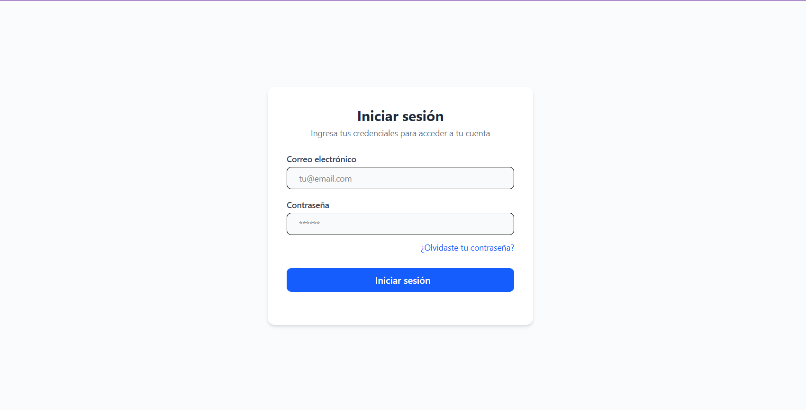
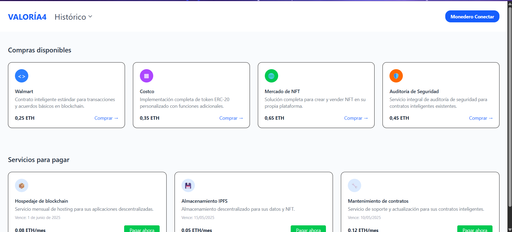
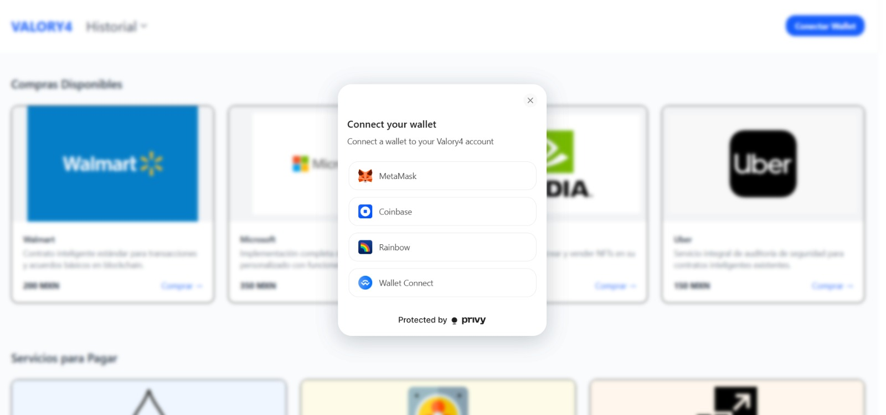

# V A L O R Y 4

## ESP
Un sistema de compras para empresas que busca reducir la corrupción y mejorar la transparencia y confianza en los procesos de adquisición de bienes y servicios.
## ENG
A purchasing system for companies aimed at reducing corruption and improving transparency in the procurement of goods and services.

## Configuración del entorno 
Antes de proceder con la instalación, es necesario saber que este proyecto se creo con las siguientes versiones:  

- **Node.js**: `v22.14.0`  
- **npm**: `v10.9.2`  


## Instalación

Sigue estos pasos para configurar el proyecto en tu entorno:/Follow these steps to set up the project in your environment:

### Clonar el repositorio / Clone the repository

Ejecuta el siguiente comando en la terminal para desgargar el código fuente / 
Run the following command in your terminal to download the source code:

```bash
# Clonar el repositorio en la dirección deseada
git clone https://github.com/usuario/carrito-transparente.git

# instalar las dependencias de npm y node.js / Install npm and Node.js dependencies  
npm install

# instalar las dependencias de Privy / Install Privy dependencies
npm install @privy-io/react-auth

# Ejecutar el proyecto desde la terminal / Run the project from the terminal 
npm run dev

#Luego accede en tu navegador a:

http://localhost:5173 
```

## Capturas / Screenshots





